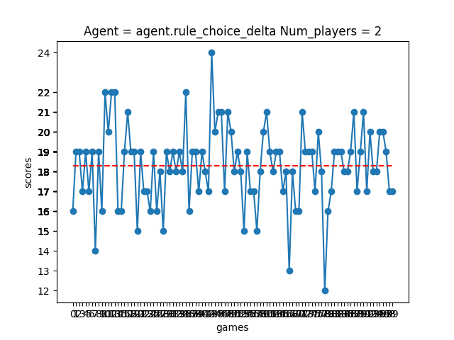
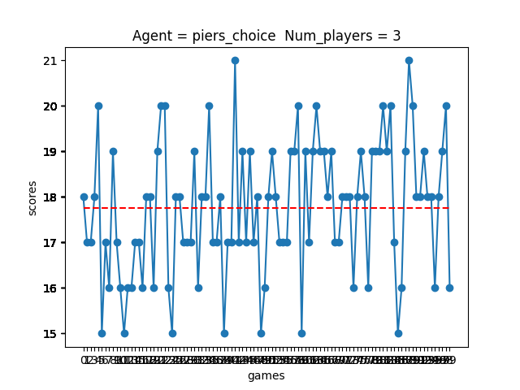
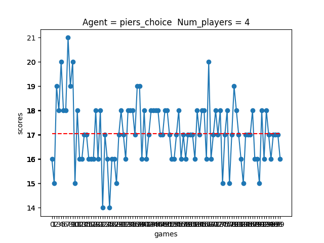
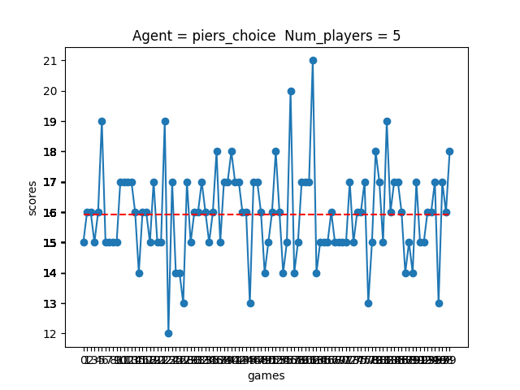

# [](https://github.com/squillero/computational-intelligence) Computational Intelligence 2021-2022 

Exam of computational intelligence 2021 - 2022. It requires teaching the client to play the game of Hanabi (rules can be found here: [](https://www.spillehulen.dk/media/102616/hanabi-card-game-rules.pdf)).

## GROUP 
*s291262* Cosimo Michelagnoli

*s292435* Alesssandro Versace

*s293662* Lise Cottin

*s287720* Giulia D'Ascenzi

## Server

The server accepts passing objects provided in GameData.py back and forth to the clients.
Each object has a ```serialize()``` and a ```deserialize(data: str)``` method that must be used to pass the data between server and client.

Watch out! I'd suggest to keep everything in the same folder, since serialization looks dependent on the import path (thanks Paolo Rabino for letting me know).

Server closes when no client is connected.

To start the server:

```bash
python server.py <minNumPlayers>
```

Arguments:

+ minNumPlayers, __optional__: game does not start until a minimum number of player has been reached. Default = 2


Commands for server:

+ exit: exit from the server

## Client

To start the client:

```bash
python client.py [-h] [--ip IP] [--port PORT] [--player-name PLAYER_NAME | --ai-player AI_PLAYER]
```

Arguments:
+ ip: IP address of the server (for localhost: 127.0.0.1)
+ port: server TCP port (default: 1024)
+ player-name: the name of the player (if you want to play manually)
+ ai-player: the name of your AI player (if you want to play in AI mode)

If playing in manual mode, commands for client:
+ exit: exit from the game
+ ready: set your status to ready (lobby only)
+ show: show cards
+ hint \<type> \<destinatary>:
  + type: 'color' or 'value'
  + destinatary: name of the person you want to ask the hint to
+ discard \<num>: discard the card *num* (\[0-4]) from your hand

### Strategy for the client in AI mode

This code proposes a rule-based AI agent to play the game of Hanabi.
This kind of strategy consists in having a set of rules representing
various moves that can be played and to apply them in specific contexts.
The order and the condition(s) under which the rules are applied is crucial
for the outcome of the game and will be called in the following "flow".

The set of rules implemented is listed below and unfolds in three categories :
the "play" moves, the "discard" moves and the "hint" moves, which are the
three basic things you can do when your turn comes. Within each of these
categories are developed several strategies that appear to be useful in
different contexts.

+ Play moves
  + ```play_best_card_prob```: plays the best card (in terms of the card that 
  would transform more cards in other players hands to playable) that has
  a given probability of being playable
  + ```play_oldest```: plays the oldest card in the hand

+ Discard moves
  + ```discard_useless_card```: discards a card that will never become playable
  + ```discard_less_relevant```: discards the less relevant card of the hand
  + ```discard_duplicate_card```: discards a duplicate card
  + ```discard_oldest```: discards the oldest card

+ Hint moves
    - ```give_helpful_hint```: give a hint that will allow a player to have full knowledge of one of its playable
        cards
    - ```give_useful_hint```: give a hint about a playable card to another player
    - ```tell_most_information```: give a hint that concerns the higher number of cards in a player's hand
    - ```tell_unknown```: give a hint about an unknown characteristic of a card, prioritizing color, to a random player
    - ```tell_useless```: give a hint about a useless cards to another player
    - ```tell_ones```: give a hint about cards with value 1 to a random player
    - ```tell_fives```: give a hint about cards with value 5 to a random player
    - ```tell_randomly```: give a hint about a random card (with priority for color hints) to a random player


With these rules, several flows have been implemented and tested in order to see
what ordering yield th best results. Some tested flows have been inspired by 
papers (van Der Bergh with its variant, Piers and Osawa) while others have been 
designed by us (alpha, beta and delta). To compare the performances of these flows we
ran 100 games using each strategy for every possible configuration of number of players and stored
the results along with the average scores over all games. The results are displayed in the
table below (the values in bold correspond to the best scores obtained for the number of players
considered).


Algorithm | 2 players | 3 players | 4 players | 5 players
--- | --- | --- | --- |--- 
van Der Bergh | 13 | 13 | 13.9 | 13.5 
van Der Bergh - probability | 15.5 | 17.3 | **17.3** | 16
Piers | 17.2 | **17.8** | 17.1 | **16**
Osawa | 14 | 16.4 | 16 | 14.9
Alpha | 17.1 | 17 | 16.2 | 15.2 
Beta | 18.3 | 17.3 | 16.4 | 15.6 
Delta | **18.4** | 17.4 | 16.8 | 15.4 

According to those results, we decided to use the Delta agent for games with two players and the Piers agent for the games with more players.
In the figures below are displayed the results of the experiment for the winning strategy for each
number of players.







