# RESULTS

## vanDerBergh_choice
| Agent  | Number of Players   | Number of games   |Results   |  Notes |
|---|---|---|---|---|
|  vanDerBergh_choice | 2 | 100 | 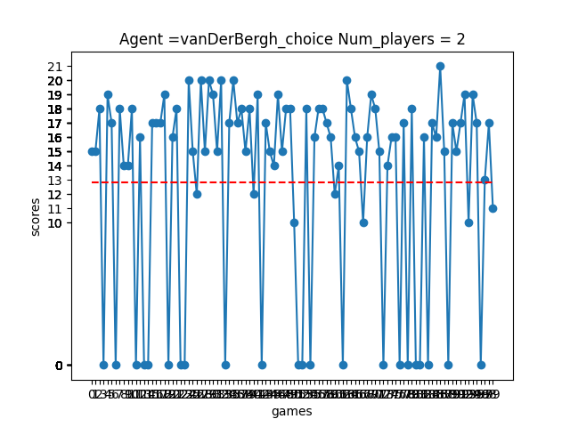  |   |
|  vanDerBergh_choice | 3 | 100 | 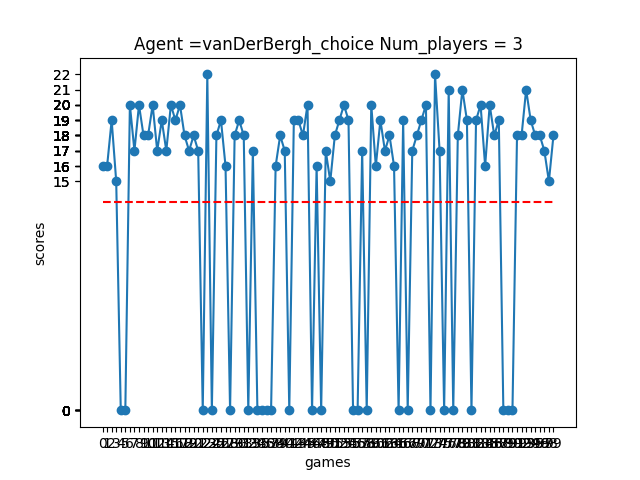 |   |
|  vanDerBergh_choice | 4 | 100 | 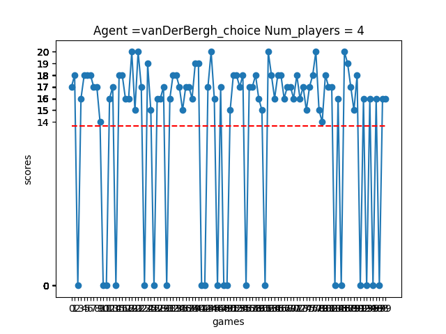  |   |
|  vanDerBergh_choice | 5 | 100 | 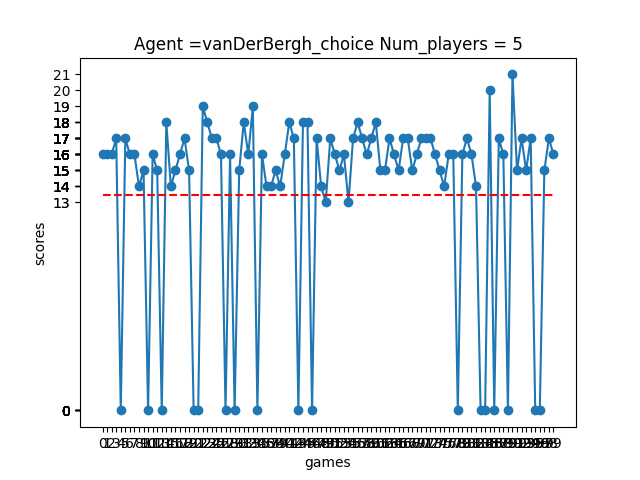|   |

## vanDerBergh_choice_prob

| Agent  | Number of Players   | Number of games   |Results   |  Notes |
|---|---|---|---|---|
|  vanDerBergh_choice_prob | 2 | 100 | 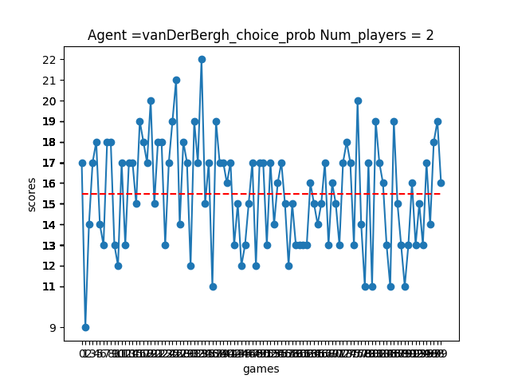  |   |
|  vanDerBergh_choice_prob | 3 | 100 | 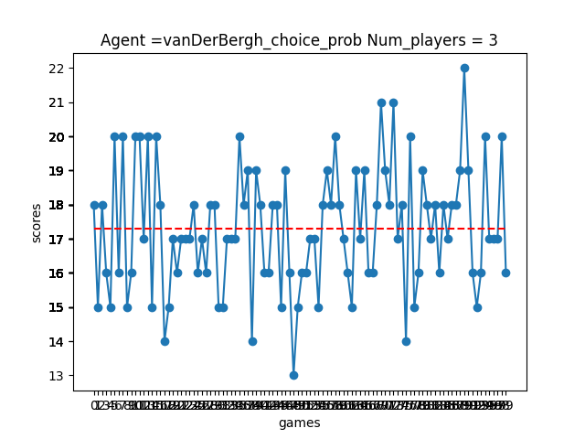 |   |
|  vanDerBergh_choice_prob | 4 | 100 | 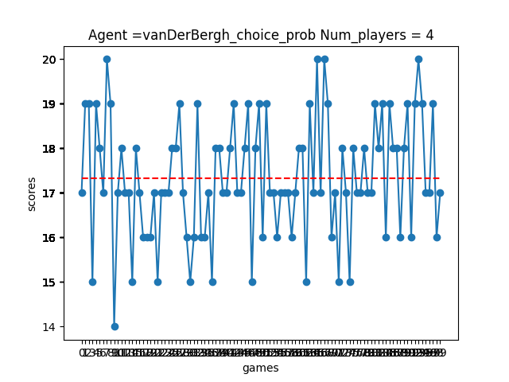  |   |
|  vanDerBergh_choice_prob | 5 | 100 | 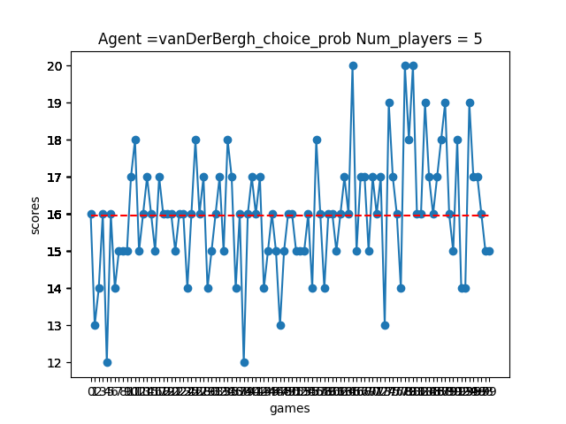|   |

## rule_choice

| Agent  | Number of Players   | Number of games   |Results   |  Notes |
|---|---|---|---|---|
|  rule_choice | 2 | 100 | 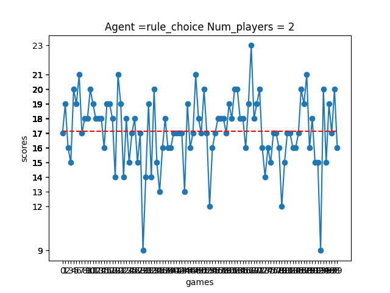  |   |
|  rule_choice | 3 | 100 | 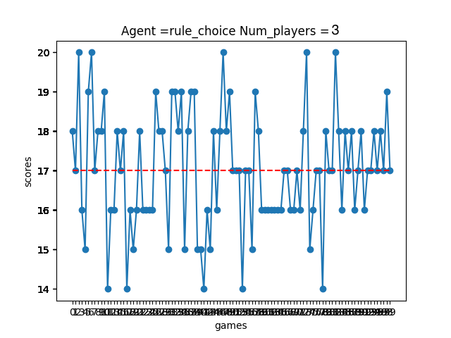 |   |
|  rule_choice | 4 | 100 | 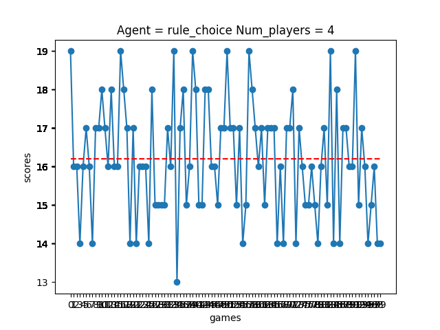  |   |
|  rule_choice | 5 | 100 | 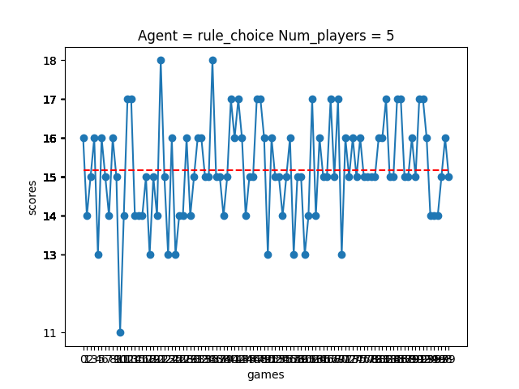|   |

## rule_choice_beta

| Agent  | Number of Players   | Number of games   |Results   |  Notes |
|---|---|---|---|---|
|  rule_choice_beta | 2 | 100 | 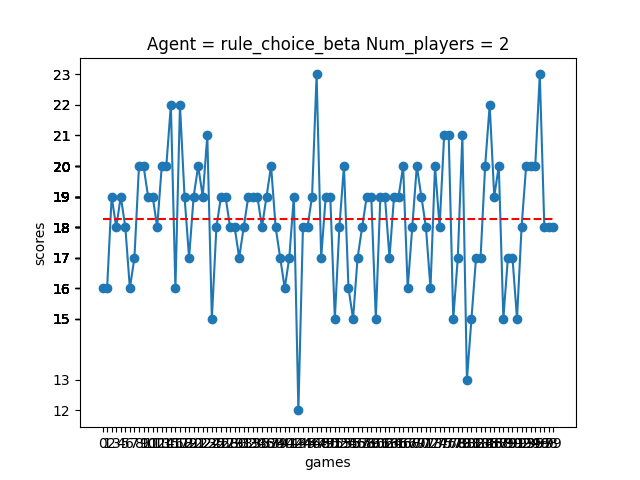  |   |
|  rule_choice_beta | 3 | 100 | 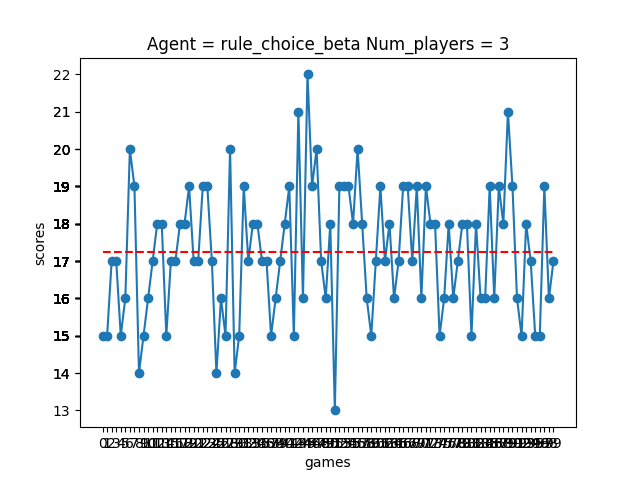 |   |
|  rule_choice_beta | 4 | 100 | 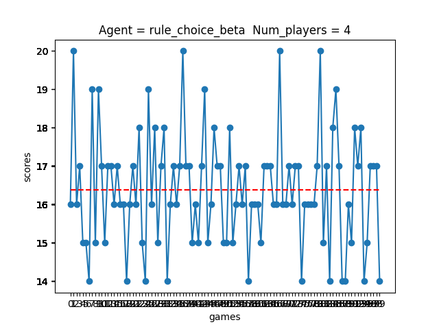  |   |
|  rule_choice_beta | 5 | 100 | 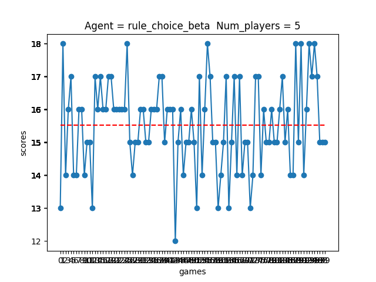|   |

## rule_choice_delta

| Agent  | Number of Players   | Number of games   |Results   |  Notes |
|---|---|---|---|---|
| rule_choice_delta | 2 | 100 |   |   |
|  rule_choice_delta | 3 | 100 | 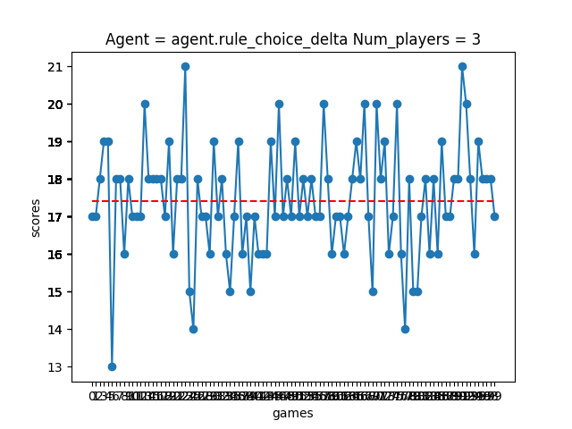 |   |
|  rule_choice_delta | 4 | 100 | 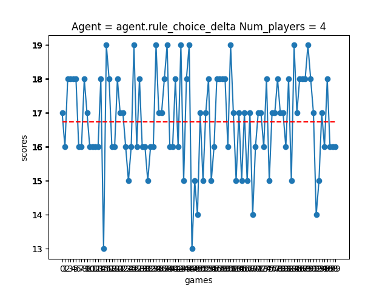  |   |
|  rule_choice_delta | 5 | 100 | 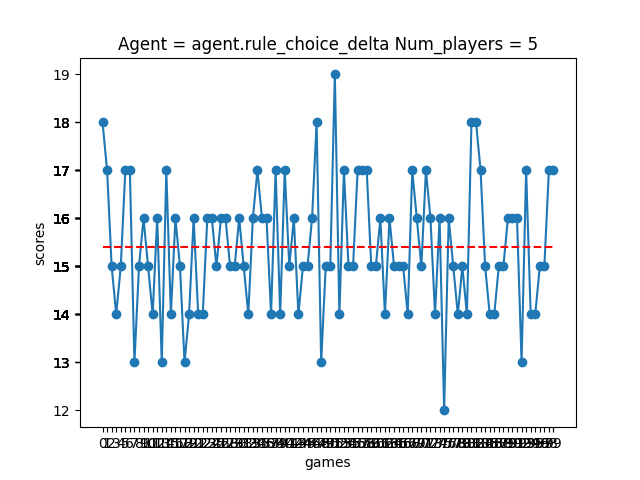|   |

